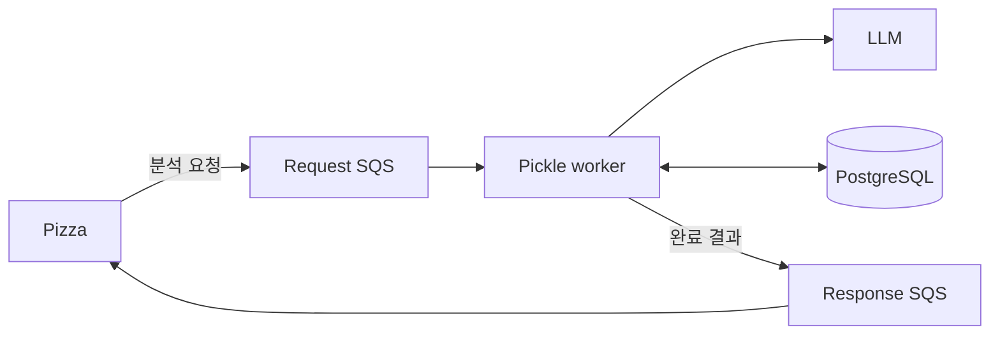

# psycho.pickle

Pizza가 SQS로 전달한 분석 작업을 LLM으로 처리하고 결과를 다시 Pizza에 통지하는 Python worker입니다. 작업 상태와 처리 이력은 PostgreSQL에 저장합니다.

## 핵심 구조



- Pizza는 분석 요청 lifecycle의 기준 상태를 소유합니다.
- Pickle은 작업 소비, LLM 호출, 결과 저장과 통지를 담당합니다.
- 결과는 SQS로 통지하며, SQS URL이 없으면 설정된 HTTP endpoint를 사용합니다.

> 현재 LangChain 기반 처리 경로와 이전 OpenAI webhook·stale job recovery 경로가 함께 남아 있습니다. LLM 호출의 최종 실패를 Pizza에 통지하는 정책은 아직 구현되지 않았습니다.

## 로컬 실행

Python 3.12, [uv](https://docs.astral.sh/uv/)와 PostgreSQL이 필요합니다.

```bash
uv sync
cp .env.local.example .env.local
uv run uvicorn app.main:app --host 0.0.0.0 --port 8000 --reload
```

`.env.local`에는 다음 설정이 필요합니다.

- PostgreSQL: `DATABASE_URL` 또는 `DB_HOST`, `DB_PORT`, `DB_NAME`, `DB_USERNAME`, `DB_PASSWORD`
- OpenAI: `OPENAI_API_KEY`, `OPENAI_WEBHOOK_SECRET`
- worker: `ENABLE_INPROCESS_WORKER=true`, `SQS_LISTENER_QUEUE_URL` 또는 legacy `SQS_QUEUE_URL`
- 결과 통지: `BUSINESS_NOTIFY_SQS_QUEUE_URL` 또는 `BUSINESS_NOTIFY_URL`

전체 설정과 기본값은 [`app/config.py`](app/config.py)를 확인합니다. API만 실행하려면 worker를 비활성화할 수 있습니다.

## API

- `GET /health`: 프로세스 health check
- `POST /openai/webhooks`: OpenAI response webhook 수신

분석 작업은 HTTP API가 아니라 Request SQS로 수신합니다.

## 배포

`master` push가 CI를 통과하면 bundle을 S3에 업로드하고 AWS CodeDeploy로 EC2에 배포합니다. 배포 script는 AWS SSM Parameter Store의 `/psycho/prod` 설정으로 `.env`를 만들고 `pickle.service`를 실행합니다.

## 문서

- [`docs/conventions/testing.md`](docs/conventions/testing.md): 테스트 계층, fixture와 characterization test 기준
